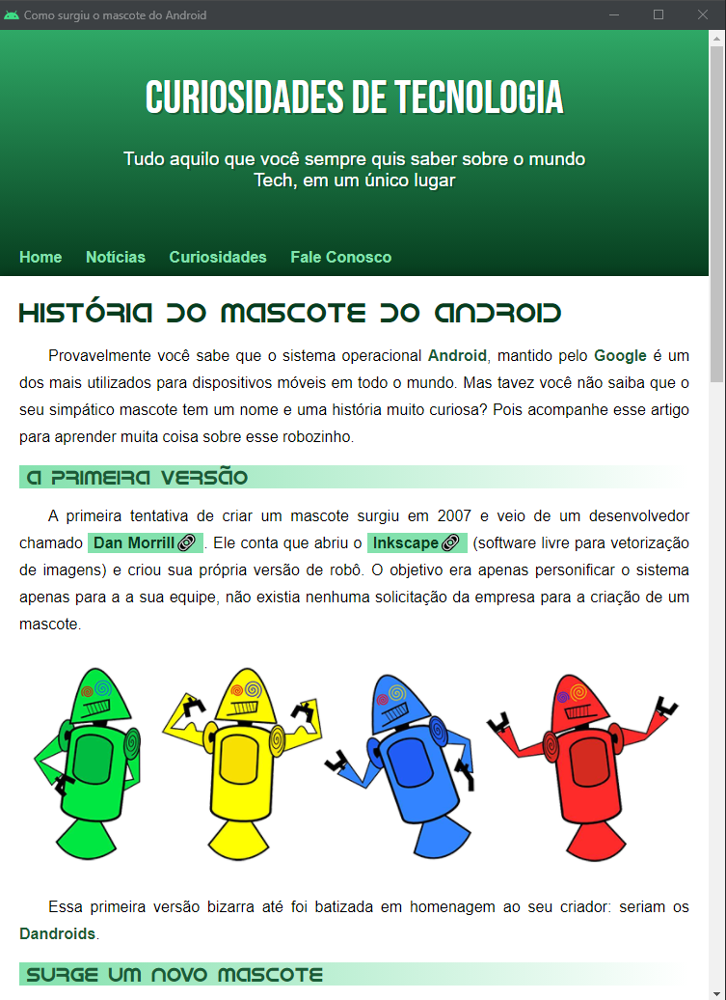
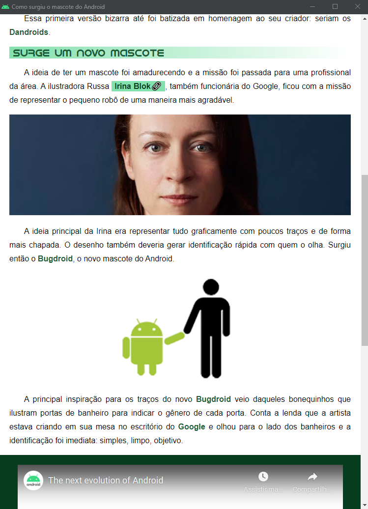
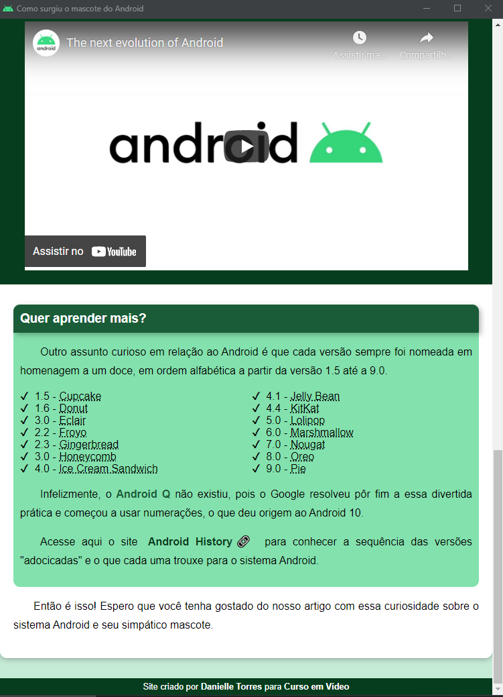

# MascoteAndroid
 
### Olá! Eu sou Danielle Torres 👋

### Este projeto foi um desafio do Curso em Vídeo, onde deveríamos criar uma página de site falando sobre o Mascote do Android
### Seguem abaixo as imagens do projeto

 

       
       
      

### Tecnologia utilizada

    
     

